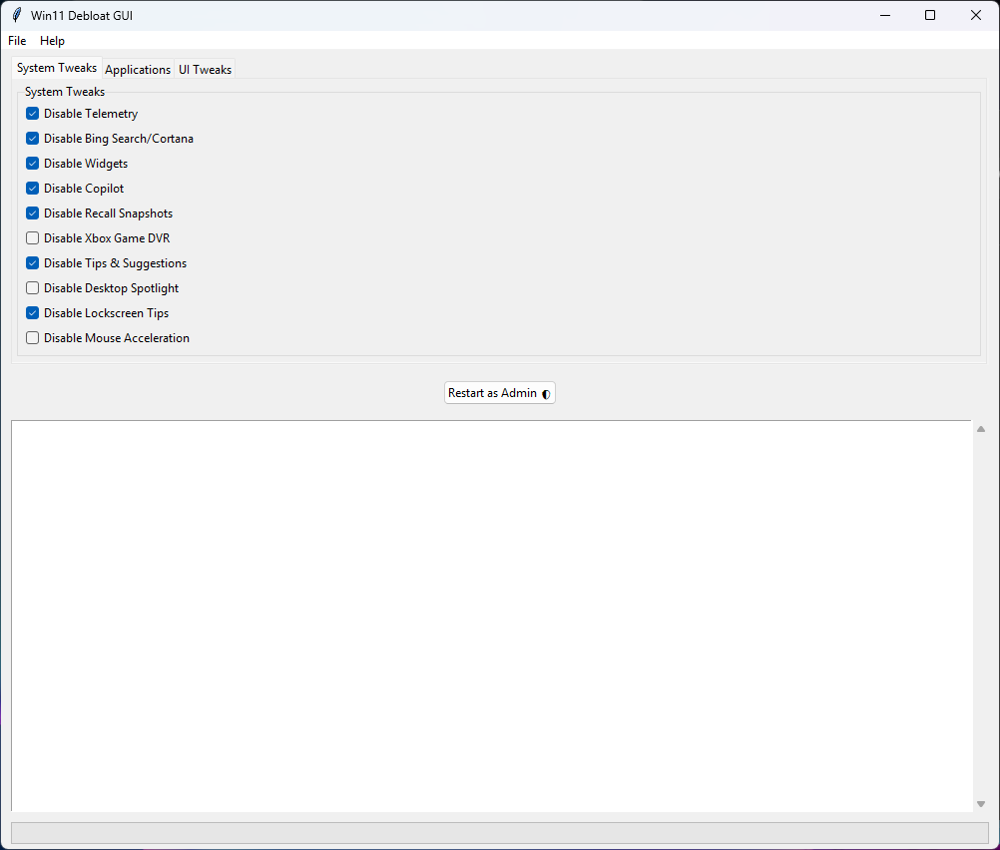

# Win11Debloat GUI 🖥️🔧

A user-friendly GUI wrapper for the Win11Debloat PowerShell scripts, providing easy access to Windows 11 optimization tools with proper privilege management and real-time feedback.

## Features ✨
- **Automatic Admin Check**: 
  - Restart button appears when non-admin
  - Auto-restarts with UAC prompt
- **Real-time Terminal Output**:
  - Live progress monitoring
  - Colored status messages
- **Smart UI Controls**:
  - Start/Cancel button toggling
  - Context-sensitive menu items
- **Persistent Settings**:
  - JSON configuration storage
  - Auto-load/save preferences
- **Safety Features**:
  - File existence verification
  - Error handling with user feedback
  - Process cancellation support

## Prerequisites 📋
- Python 3.6+
- Tkinter (usually included with Python)
- PowerShell 5.1+
- Administrator rights (for full functionality)

## Donate

